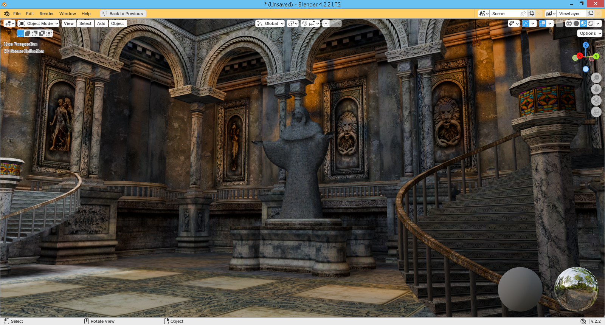

### PK_tools
------------
## MPK Import
<a target="_blank" rel="noopener noreferrer" title="Download Add-on" href="https://github.com/max-ego/PK_tools/releases/download/mpk_import_blender_4.2_lm/io_scene_mpk.zip">**io_scene_mpk**</a> is a <a target="_blank" rel="noopener noreferrer" title="Release 4.2 LTS Download Page" href="https://www.blender.org/download/releases/4-2/">**Blender 4.2**</a> add-on designed to import data from ***.mpk** (<a target="_blank" rel="noopener noreferrer" title="Google Search" href="https://www.google.com/search?q=Painkiller+game+2004">**Painkiller game**</a> WorldMesh).
#### How to install:
See <a target="_blank" rel="noopener noreferrer" title="Installing Legacy Add-ons" href="https://docs.blender.org/manual/en/4.2/editors/preferences/addons.html#prefs-extensions-install-legacy-addon">**Installing Legacy Add-ons — Blender Manual**</a>.

------------

------------